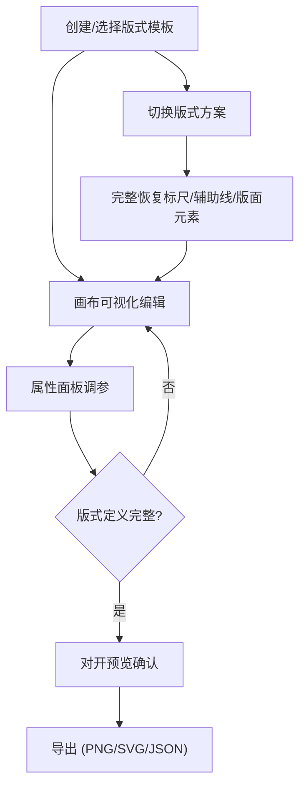

## 1. 产品概述

古籍数字化版式编辑器——专为古籍数字化排版人员设计的专业前端编辑器，重点复刻"版心、鱼尾、栏线、天头地脚"等传统古籍页面结构，而非普通文本编辑。

- 目标用户：古籍数字化排版人员、古籍修复与出版从业者
- 核心价值：以可视化、可拖拽的方式精确还原古籍版面结构，极大提升古籍数字化排版效率

## 2. 核心功能

### 2.1 用户角色

| 角色 | 说明 |
|------|------|
| 排版人员 | 创建、编辑、导出古籍版式模板 |

### 2.2 功能模块

1. **编辑器主页面**：版式画布编辑区、模板列表侧边栏、属性面板、标尺辅助线、左右页对开预览

### 2.3 页面详情

| 页面 | 模块 | 功能描述 |
|------|------|----------|
| 编辑器主页 | 版式列表侧边栏 | 展示所有版式模板，支持新增、复制、删除、切换，版式编号唯一校验 |
| 编辑器主页 | 画布编辑区 | 基于 Konva.js 的可视化画布，拖拽版框、调整页心位置，实时渲染版心、鱼尾、栏线、天头地脚 |
| 编辑器主页 | 标尺与辅助线 | 水平/垂直标尺，可拖拽辅助线，支持 mm/px/寸单位切换 |
| 编辑器主页 | 属性面板 | 编辑页面尺寸、页边距（天头地脚）、版框线宽、栏线配置、鱼尾样式、版心中线 |
| 编辑器主页 | 左右页对开预览 | 模拟古籍对开效果，装订边自动避让，左页右侧与右页左侧留装订间距 |
| 编辑器主页 | 导出功能 | 导出 PNG/SVG/JSON，未完成基础版式定义的页面禁止导出 |

## 3. 核心流程

用户创建新版式 → 在画布中可视化编辑版框/栏线/鱼尾等元素 → 通过属性面板精确调参 → 切换到对开预览确认效果 → 校验通过后导出

## 4. 用户界面设计

### 4.1 设计风格

- **主色调**：深墨色 (#1a1a2e) + 古纸色 (#f5f0e8) + 朱砂红 (#c53d43) 作为强调色
- **布局**：桌面端三栏布局——左侧版式列表、中间画布、右侧属性面板
- **字体**：使用 Noto Serif SC 作为中文衬线字体，体现古籍文化气息
- **按钮风格**：微圆角、低饱和度，避免现代感过强
- **图标**：线性图标，笔画纤细

### 4.2 页面设计概览

| 页面 | 模块 | UI 元素 |
|------|------|---------|
| 编辑器主页 | 版式列表 | 卡片式列表、编号标签、状态指示、新增/复制/删除按钮 |
| 编辑器主页 | 画布区域 | Konva Stage、标尺条、辅助线、缩放控制、网格背景 |
| 编辑器主页 | 属性面板 | Naive UI 表单、数字输入、颜色选择、下拉选择、折叠面板 |
| 编辑器主页 | 对开预览 | 弹窗/抽屉、左右页并排、装订线标记、缩略图 |
| 编辑器主页 | 导出对话框 | 格式选择、DPI 设置、校验提示、导出按钮 |

### 4.3 响应式

桌面端优先设计，画布区自适应可用空间，侧边栏可折叠

## 5. 业务约束规则

| 规则 | 描述 |
|------|------|
| 版式编号唯一 | 新建/编辑时校验编号不重复 |
| 栏线宽度 > 0 | 栏线宽度必须为正数 |
| 版心不超版框 | 版心区域（去边距后）必须完全在版框内 |
| 装订边自动避让 | 左右页对开时，装订侧自动预留间距 |
| 未完成禁止导出 | 基础版式定义不完整时，导出按钮禁用并提示 |
| 方案切换完整恢复 | 切换版式时，标尺、辅助线、缩放、选中元素全部恢复 |
