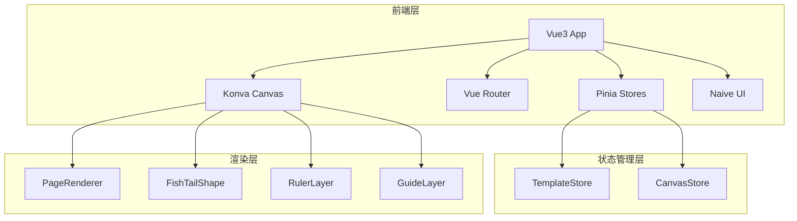

## 1. 架构设计



## 2. 技术说明

- **前端框架**：Vue 3.4 + TypeScript + Composition API (`<script setup>`)
- **状态管理**：Pinia + pinia-plugin-persistedstate（持久化到 localStorage）
- **画布渲染**：Konva.js 9.x + vue-konva 3.x
- **UI 组件库**：Naive UI 2.x
- **路由**：Vue Router 4.x
- **构建工具**：Vite 5.x
- **无后端**：纯前端应用，数据通过 localStorage 持久化，JSON 导出/导入

## 3. 路由定义

| 路由 | 用途 |
|------|------|
| `/` | 编辑器主页面（含画布、侧边栏、属性面板） |

## 4. 项目目录结构

```
src/
├── main.ts                    # 入口文件
├── App.vue                    # 根组件
├── router/
│   └── index.ts               # 路由配置
├── stores/
│   ├── template.ts            # 版式模板 Store（已有）
│   └── canvas.ts              # 画布状态 Store
├── types/
│   └── index.ts               # 类型定义（已有）
├── utils/
│   └── validation.ts          # 校验工具（已有）
├── composables/
│   ├── useCanvasRenderer.ts   # 画布渲染逻辑
│   └── useSpreadView.ts       # 对开预览逻辑
├── components/
│   ├── layout/
│   │   ├── AppHeader.vue      # 顶部导航栏
│   │   └── AppSidebar.vue     # 左侧版式列表
│   ├── editor/
│   │   ├── EditorCanvas.vue   # 主画布容器
│   │   ├── PageRenderer.vue   # 单页渲染器
│   │   ├── FishTailShape.ts   # 自定义鱼尾 Konva Shape
│   │   ├── RulerBar.vue       # 标尺条
│   │   └── GuideLayer.vue     # 辅助线层
│   └── panel/
│       ├── PropertyPanel.vue  # 属性编辑面板
│       ├── SpreadPreview.vue  # 对开预览
│       └── ExportDialog.vue   # 导出对话框
└── views/
    └── EditorView.vue         # 编辑器主视图
```

## 5. 核心数据模型

### 5.1 已有类型（src/types/index.ts）

- `PageTemplate`：版式模板完整定义
- `FishTailConfig`：鱼尾配置（位置、样式、尺寸）
- `ColumnConfig`：栏线配置（栏数、线宽、间距）
- `BorderConfig`：版框线配置
- `PageMargins`：天头地脚边距
- `CanvasState`：画布状态（缩放、偏移、标尺、辅助线）
- `GuideLine`：辅助线
- `RulerConfig`：标尺配置
- `ExportOptions`：导出选项

### 5.2 Canvas Store 状态

```typescript
interface CanvasStoreState {
  scale: number
  offsetX: number
  offsetY: number
  showRuler: boolean
  showGuides: boolean
  guides: GuideLine[]
  ruler: RulerConfig
  selectedElement: string | null
  showSpreadPreview: boolean
  showExportDialog: boolean
}
```

## 6. 关键业务逻辑

### 6.1 版式编号唯一校验
在 `TemplateStore.updateTemplate` 和 `addTemplate` 中通过 `isCodeDuplicate` 方法校验。

### 6.2 栏线宽度 > 0
在 `validateTemplate` 中校验 `column.lineWidth > 0` 和 `border.lineWidth > 0`。

### 6.3 版心不超版框
通过计算 `pageSize - margins` 得到版心区域，确保其尺寸为正数。

### 6.4 装订边自动避让
对开预览时，左页右移 `bindingMargin` 像素，右页左移 `bindingMargin` 像素，两页之间留出装订间距。

### 6.5 未完成禁止导出
导出前调用 `isTemplateComplete` 校验，不通过则禁用导出按钮。

### 6.6 方案切换完整恢复
切换版式时，Canvas Store 保存每个版式对应的 `scale`、`offsetX/Y`、`guides`、`selectedElement`，切换时完整恢复。
